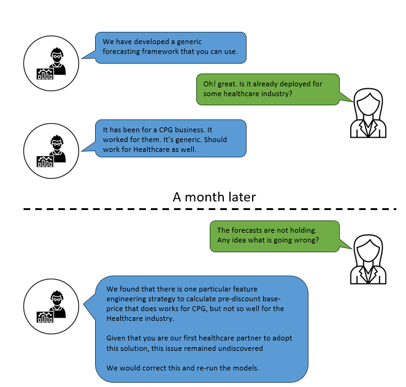

# DBN-Data-Generator
A synthetic data generator based on Dynamic Bayesian Networks, apt for generating multivariate timeseries data.

# Motivation
The motivation of this project comes from a series of real-world scenarios commonplace in Data Science domain. The scenarios are explained in a step-by-step manner.

## 1. A relatable scenario in ML-based enterprises
**_ML ABC_** is an enterprise that provides ML-based solutions like _Forecasting_, _Price Recommendation_, _Promotion Optimization_ etc. to businesses across industries like CPG, Retail, Healthcare, Energy etc. Below is a conversation that happens between development teams from **_ML ABC_** and the client.

<ins>**Does this scenario look familiar?**</ins> Let’s dive deeper into the source of such embarrassing scenarios.
